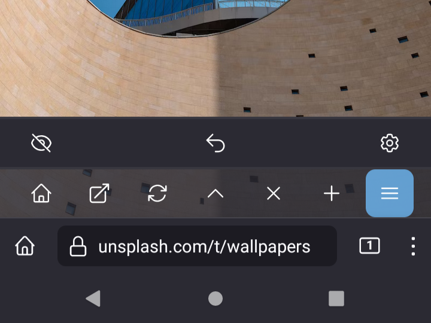
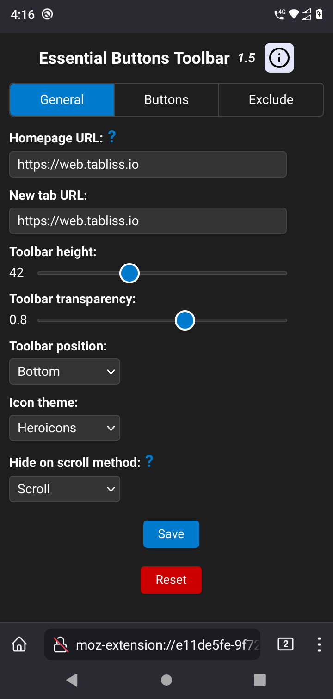
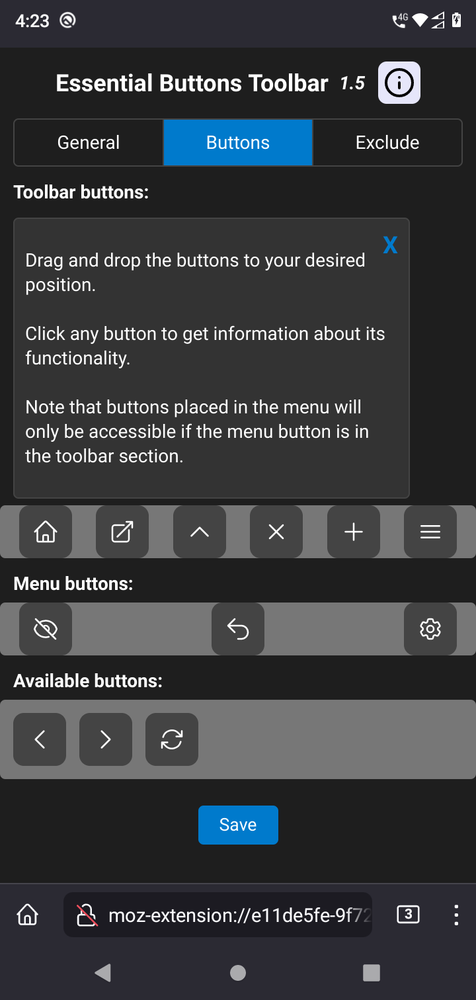
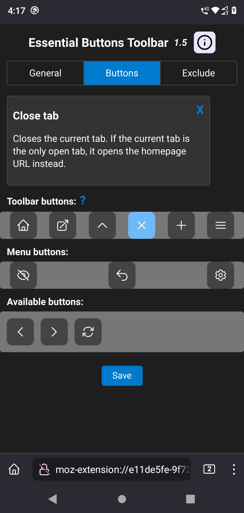
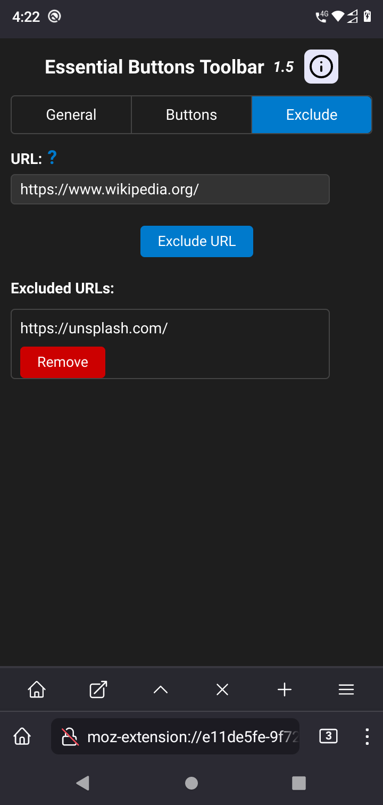

# Essential Buttons Toolbar.
*Adds a toolbar to Android Firefox with essential buttons: Homepage, Duplicate Tab, New tab, Close tab and more.*  

## Some screenshots.
     

   

## Why?  
This add-on aims to fill basic missing functionality in Android Firefox. The main reason is to provide a normal home button.  
The home button should not behave as the new tab button. This behavior is not intuitive and differs from the standard behavior found in most browsers, including the desktop version of Firefox, which follows the universal approach to the home button.  
You can check other user opinions here:  
https://connect.mozilla.org/t5/ideas/on-firefox-mobile-make-home-page-links-open-in-current-tab/idi-p/15672  
Other buttons are being added to offer easier access or missing functionality.  

## Features.  
**Available buttons are:**  
- **Homepage:** Opens the default homepage URL. Can be changed in options.  
- **Duplicate Tab:** Opens current URL in new tab.Long-press it to access the browser's default link options, such as opening in the background, copying the link, etc.  
- **Hide toolbar:** Hides the toolbar. Refresh the page to display it again.  
- **Move toolbar:** Moves the toolbar to the top of the page or to the bottom if it is at the top.  
- **Close tab:** Closes the current tab. If the current tab is the only open tab, it opens the homepage URL instead.  
- **New tab:** Opens the default new tab page URL. Can be changed in options.  
- **Go back:** Navigate back in history.  
- **Go forward:** Navigate forward in history.  
- **Reload:** Reloads the current page.
- **Menu:** Opens an additional bar. This feature is provided to improve organization. Buttons in the menu can be customized on the settings page.
- **Undo Close Tab:** Opens in a new tab the most recently closed tab by this add-on. Please note that, at the moment, it does not keep track of tabs closed by the browser or other add-ons.
- **Settings:** Opens the settings page for this add-on in a new tab.

**Other options include:**  
- **Toolbar height:** The number of pixels. The default value is set to 42px.  
- **Toolbar transparency:** Adjust it to your liking. 
- **Toolbar default position:** Top or bottom.  
- **Icon theme:** Feather Icons and Heroicons available.  
- **Hide on scroll method:** Option to change the used method or to disable it.  
- **Toolbar buttons:** Enable/disable the buttons and change their position.  
- **Exclude URLs:** Specify which web addresses to exclude.  

This extension does not access, log, or share your data. It is also ad-free and will always remain so.  

The icons used in this extension are from the elegant Feather Icons collection:  
https://github.com/feathericons/feather  
The beautiful Heroicons theme is also available:  
https://github.com/tailwindlabs/heroicons  

**Permissions:**  
**Access browser tabs:** Allows the extension to check the number of open tabs, allowing the close button to open the home page if only one tab is open.  
**Access your data for all websites:** Allows the extension to insert the toolbar on permitted websites.

## Installation instructions.
The add-on is available on AMO (Mozilla Add-ons):  

## Version history.
You can see the changelog here:  
https://addons.mozilla.org/en-US/android/addon/essential-buttons-toolbar/versions/

## Support me.
Love this add-on? Help me keep it awesome! Consider donating to support future updates:  

  

Thanks for your support! 🚀  

## Tips and tricks.
There is no way to set the Firefox homepage to the one opened by this add-on.  
While some users use the Firefox home button as a new tab button, I suggest that you ignore that button and disable all the settings by going to **Menu** -> **Settings** -> **Homepage**, and under Opening screen, select **Last tab.**

It is also very useful to change the settings in **Delete browsing data on quit.** You can uncheck all the options except for **Cached images and files.** Enabling this option will display a **Quit** option at the bottom of the Firefox menu. Closing the browser in this way is ideal, as the next time you open the browser, it will load the pages you had opened.

 

## Default homepage.
The default homepage URL used in this add-on is the beautiful and awesome Tabliss.  
https://tabliss.io/  
Their Firefox add-on has the recommended tag.  
https://addons.mozilla.org/es/firefox/addon/tabliss/  
However, it does not work for Android Firefox due to the current restrictions in the functionality of mobile add-ons.  
Nevertheless, we can use its web version.  
https://web.tabliss.io/  

Here is a list of the pros and cons of this web homepage:  

**Pros:**  
- Beautiful and customizable.
- Open-source.
- Option for persistent storage, making it available offline.
- Responsive design that adapts very well to phone screens.

    

**Cons:**  
- Last updated two years ago.
- The inspirational quotes widget does not work.
- Adding links to the Quick Links widget is time-consuming.

Remember, you can choose any website, even 'about:blank' if you wish. Another good option could be booky.io:  
https://booky.io/

## Known issues:
Some websites are not well optimized for mobile. Some will have a little zoom that will make the toolbar be displayed outside of the viewport or display only a part of it. You can find the toolbar by zooming out, as shown in the following screenshots:

 

## Note:
This initially began as a userscript, which I later developed into an extension to access additional features.  
You can still find the original user script here, but I'm unlikely to make further updates to it:  
https://github.com/KristhianX/a-real-home-button
